# 220526 FC
한 번에 끝내는 컴퓨터 공학 전공필수 & 인공지능 심화 초격차 패키지 Online. 

## 컴퓨터 네트워크
- 네트워크
  - 종단 시스템(end system)  
    pc나 스마트폰 처럼 네트워크 송수신 주체
  - 프로토콜(Protocol)
    두 이종 시스템을 연결하기 위한 규약
  - 통신을 목적으로 실제 물리적으로 선으로 연결되어 있거나 무선으로 연결됨
- 인터넷  
  회사 혹은 소규모의 네트워크에서 전세게 네트워크와 연결된 상태
  - 다양한 애플리케이션 서비스 제공
  - 종단 시스템은 보통 ISP(Internet Service Provider) 에 의해 연결

- OSI 7계층(Layer)  
  네트워크 구성요소를 7개의 계층으로 역할을 나눈 표준 모델
  - 각 계층별 역할을 통해 통신 규격(프로토콜)을 만족
  - 일부 하위계층은 하드웨어에서 구현되어 상위계층은 소프트웨어로 구현
- TCP/IP(Tranmission Control Protocol/Internet Protocol)
  OSI 7계층이 나오기 전 널리 사용되던 사실상 표준 역할
  - 각 계층별 역할에 따라 역할이 나누어짐
  - OSI 7계층이 대부분이 가지고 있음

- IP 주소(Address)  
  통신 자료를 최종적으로 전달하기 위해 필요한 송/수신 위치정보
  - 보통 IPv4의 주소 사용, 주소 부족으로 IPv6 개발
- 패킷 교환(Packet Switching)  
  종단간에 전송되는 데이터를 패킷(Packet)이라는 단위로 전달  
  말 그대로 데이터를 패킷으로 쪼개서 전달하는 것을 말한다
  - 패킷은 네트워크를 통해 일정한 순서없이 보내지며  
    어떤 경로를 통해 이동 되는지는 네트워크의 상항에 따라 다르다.

- 통신을 위한 기본 동작
  - 요청(Request)  
    전송하는 종단 장치에서 상대방에 서비스를 요청한다
  - 인지(Indicate)  
    수신하는 장치에서 작업 요청(이벤트)을 확인하다
  - 응답(Response)  
    수신하는 장치에서 요청받은 작업에 대해 적절히 응답한다
  - 확인(Confirm)  
    전송 측에서 응답 데이터를 최종적으로 확인하다.

- 네트워크의 유형
  - LAN(Local Area Network)
    - 일정 그룹의 지역 네트워크 (집, 사무실, 학교 등)
    - 소규모로 묶이면 사실망 등을 구축해 연결
  - WAN(Wide Area Network)
    - 원거리 통신망으로 넒은 범위 연결 (국가, 대륙 등)
  - 크기 유형
    - LAN \< WAN \< Internet  
  
   
  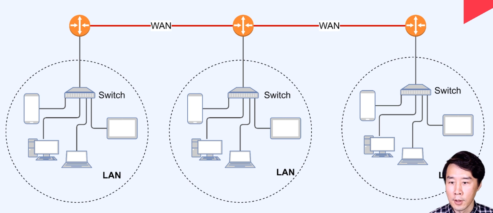 
  LAN 을 스위치로 묶고 LAN 들을 다시 WAN 으로 묶고...

- 네트워크 토롤로지
  - Ring  
    기기 간 링 형식으로 연결  
    설치 수월, 하나가 고장나면 ㅂㅂ
  - Bus  
    하나의 메인 회선에 전부 달아놓은 형태 - 초기 전산실...
  - Star  
    허브에 각각 연결 - 집에서 보통...
  - Mesh  
    하나의 장비에 여러 장비를 연결  
    어디가 고장나도 사용 가능

  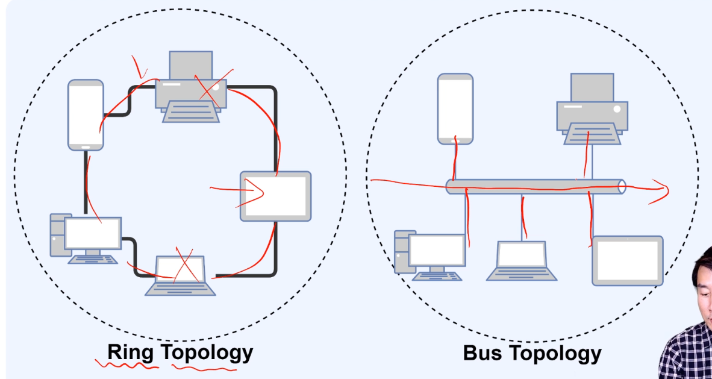
  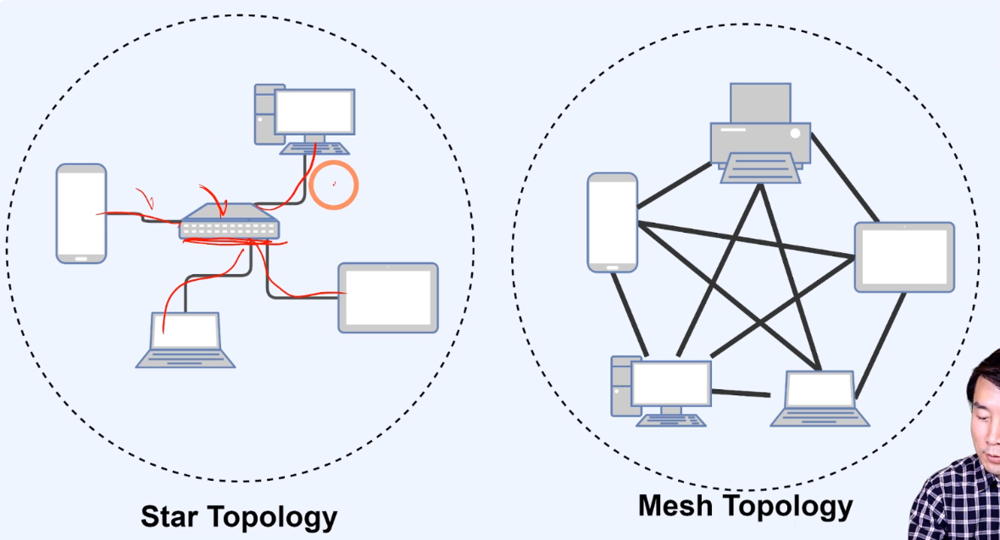

### 네트워크의 계층별 역할
- OSI 7 Layer 와 TCP/IP의 관계
  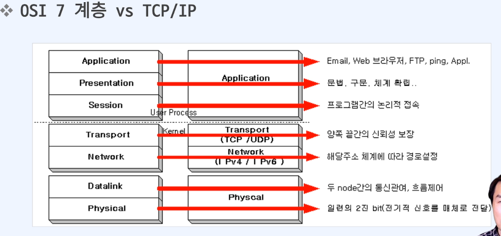  

- 큰 그림  
  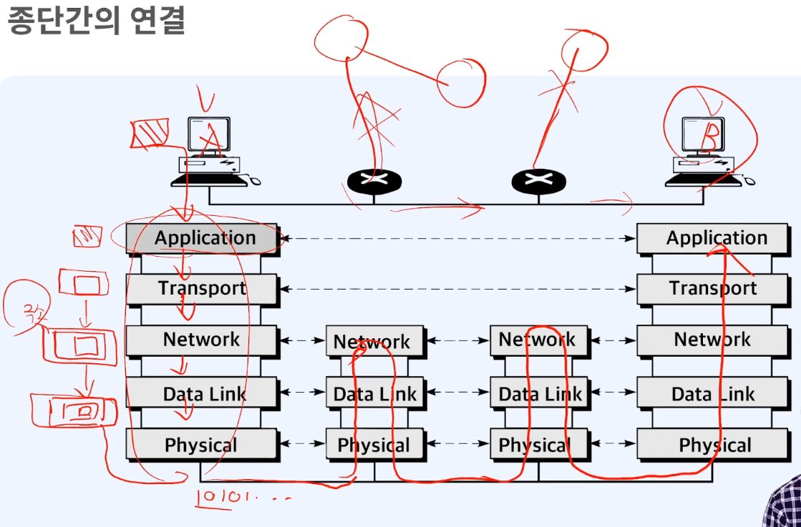

- 물리 계층(Physical layer)
  - 개요
    - 물리적 매체(transmission medium)를 통한 비트 스트림(비트를 쭈욱 보내는 과정) 전송에 요구되는 기능을 담당 (기계적, 전기적, 전송매체)
    - 물리적인 장치와 인터페이스 전송을 위해 필요한 기능과 처리절차 규정
  - 주요기능
    - 인터페이스와 매체의 물리적인 특성  
      장치와 전송매체 간의 인터페이스 특성을 규정
    - 비트의 표현  
      비트를 전송하기 위해 전기적 또는 광학적인 신호로 부호화  
      실제 신호로 비트를 표현한다는 것
    - 데이터 속도  
      신호가 유지되는 비트의 주기를 규정  
      보내는 쪽 과 받는 쪽이 속도가 맞아야 한다  
    - 비트의 동기화  
      송신자와 수신자는 같은 클록을 사용  
      클록 - H(1)/L(0) 이 주기적으로 나타나는 방형파(파가 장방형(직사각형))  
      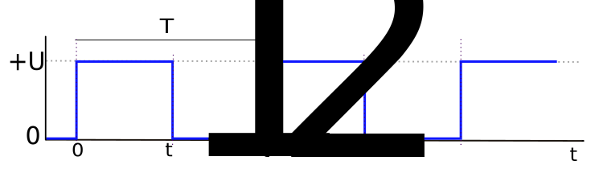
  - 하드웨어
  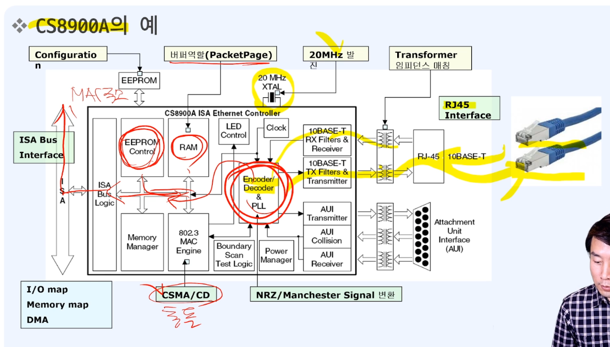

- 물리계층을 위한 프로토콜
  - MAC(Medium Access Control) 필요  
    전기신호를 주고 받는 것이기 때문에 서로 보내면 충돌이 일어나기 때문에 해결을 위한 알고리즘이 필요
    - 자유경쟁(선착순)
      - Aloha
      - Slotted Aloha - 간격 할당
      - CSMA(Carrier Sense Multiple Access)
      - CSMA/CD(CSMA/Collison Detection)
    - Token
  - CSMA/CD -> IEEE 802.3 (표준)
    - 한 slot 의 크기에 잼 신호(내가 보낼테니 다른 곳은 멈춰라)
      - 51.2 us = 64byte 전송소요 시간
    - 16번까지 재시도  
    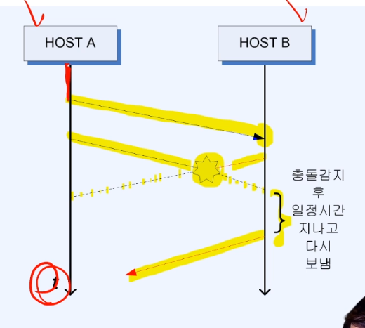

- 데이터 링크 계층(Data link layer)
  - 개요
    - 노드 대 노드 전달(node-to-node delivery)의 책임  
      - 노드  
        네트워크에 연결된 1개-1개의 기계를 의미  
        꼭 종단(End system) 을 말하는 것이 아니라 중간에 연결 위한 라우터, 스위치 등의 장치들도 포함한다.
    - Hop-to-hop delivery 라고도 부른다.  
  - 기능
    - 프레임 구성  
      네트워크 계층으로부터 받은 비트 스트림을 프레임 단위로 나눔
    - 물리주소 MAC(Medium Access Control)지정  
      송신자와 수신자의 물리 주소를 헤더에 추가
    - 흐름제어  
      수신자의 수신 데이터 전송률을 고려하여 데이터 전송하도록 제어
    - 오류제어  
      손상 또는 손실된 프레임을 발견/재전송, 트레일러(Trailer)를 이루어짐
    - 접근제어  
      주어진 어느 한 순간에 하나의 장치만 동작하도록 제어 

  - 대충 정리  
    상위 계층(네트워크 계층)에서 내려온 비트 스트림을 프레임 단위로 나누면서  
    헤더에 MAC 을 추가하고,  
    흐름/오류/접근 제어를 위한 데이터를 헤더/트레일러에 붙여서 보낸다  
    송신 받는 쪽(수신)에서는 반대로 하위 계층(물리 계층)에서  
    올라온 해체해서 상위 계층(네트워크 계층)으로 올려준다  
    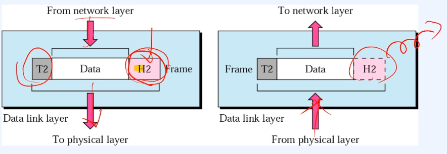

  - 데이터 링크 계층에서 사용하는 주요 프로토콜  
    - ARP(Address Resolution Protocol)
      - 주소를 해석하기 위한 프로토콜
      - 논리적인 IP주소를 물리적인 MAC주소로 바꾼다
      - 캐시를 통해 얻은 정보가 저장되고 보통 20분 수명
    - ARP(Reserve Address Resolution Protocol)
      - 역 주소 프로토콜
      - 저장 장치가 없는 네트워크 단말기 등이 IP 주소를 얻기 위해 사용  

    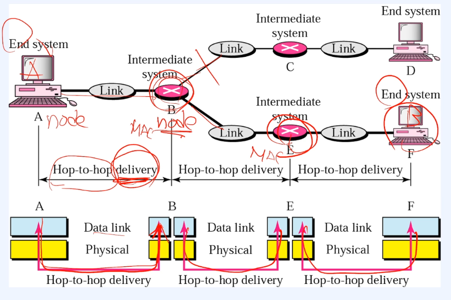
  
- 데이터 링크 계층의 전달 요소
  - 물리주소의 데이터 전달 과정
    - 물리주소 10 인 노드는 물리주소 87 인 노드에 프레임을 보냄
      - Ex) 07:01:02:01:2C:4B - 물리 주소 - MAC Address
    - 데이터 링크 수준에서 이 프레임은 헤더에 물리주소들을 가지고 있다.  
      여기서는 오직 이 주소들만 필요
    - 헤더의 끝에는 이 수준에서 필요한 다른 정보가 있다.
      트레일러에는 보통 오류검출을 위한 추가 비트들이 포함  
    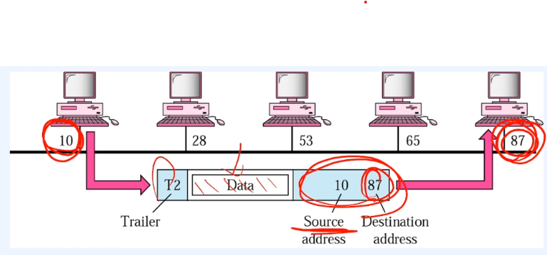

- 네트워크 계층(Network layer)
  - 개요
    - 패킷을 발신지-대-목적지 전달에 대한 책임을 가짐
  - 기능
    - 발신지-대-목적지- 전달(packet)
    - 논리 주소지정(Logical addressing) - 보통 IPv4/IPv6
      - 상위 계층에서 받은 패킷에 발신지와 목적지의 논리주소를 헤더에 추가
    - 라우팅(Routing)
      - 패킷이 최종 목적지에 전달될 수 있도록 경로를 지정하거나 교환하는 기능
  
    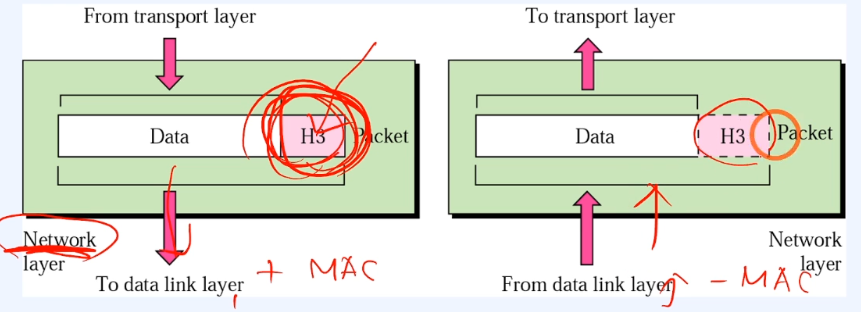

  - 주요 프로토콜
    - ICMP(Internet Control Message Protocol)  
      에러 발생 시 에러 발생 원인을 알려주거나 네트워크 상태를 진단해주는 기능
    - IGMP(Internet Group Management Protocol)  
      호스트(컴퓨터)가 멀티캐스트 그룹 구성원을 인접한 라우터에게 알리는 프로토콜
    - IP(Internet Protocol)  
      네트워크 기기에 논리적 식별을 위한 주소
      - IPv4  
        약 40억개의 주소 - 123.123.123.123 - 1byte * 4
      - IPv6  
        2의 128제곱의 개 - 21DA:21DA:21DA:21DA:21DA:21DA:21DA:21DA - 16byte * 8

  - 상세 - 발신지(Source) 대 목적지(Destination) 전달
    종단(End System) 에서 종단으로 전달
    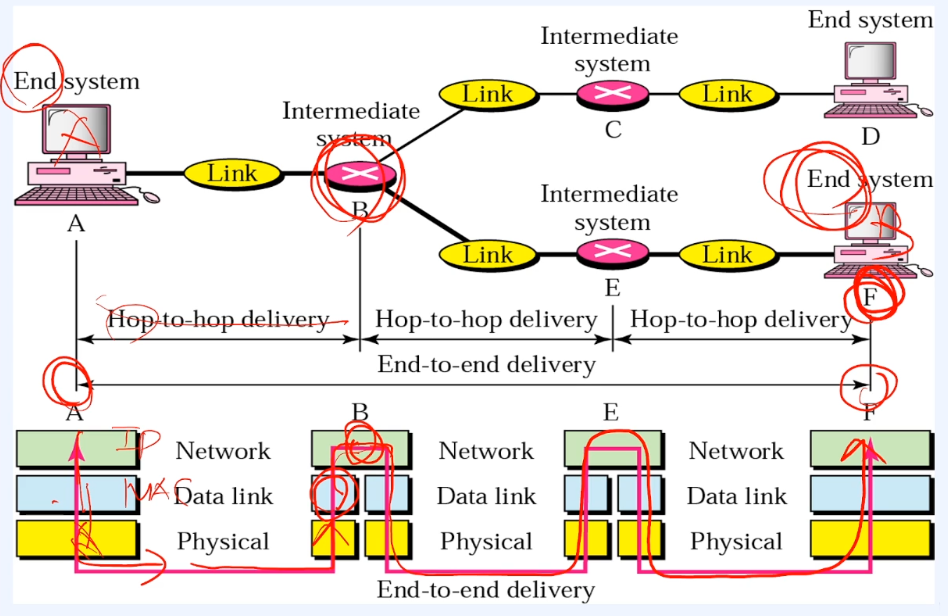
  
    - 네트워크 주소 A이고 물리주소가 10인 노드로부터  
      다른 근거리 통신망에 위치한 네트워크 주소가 P이고 물리 주소가 95인 노드로 데이터를 보낸다.
    - 두 장치는 다른 네트워크에 위치해 있기 때문에 링크주소(link address)만 사용할 수 없다.
    - 링크 주소는 자기 지역에서만 의미가 있다.  
      이제 필요로 하는 것은 근거리 통신망의 경계를 지나서도  
      전송할 수 있는 전역적인 주소. 네트워크(논리) 주소인 IP주소

    - 물리주소만으로는 원하는 논리주소가 있는 곳까지 갈 수 없다.  
      각 데이터 링크 계층(hop-to-hop) 을 지나가면서 지나갈 때 마다  
      물리주소의 출발지(바뀌는 장치)-도착지(실도착지/다음으로 바뀌는 장치)로  
      바꿔가면서 원하는 논리주소가 있는 곳으로 간다  
    - 네트워크 층은 개별적인 패킷의 종단-대-종단(end-to-end) 전송 담당
    - 전달은 상위 계층(전송 계층)에서 온 데이터를 쪼개서 패킷화 하고  
      그 패킷을 전달한다.
    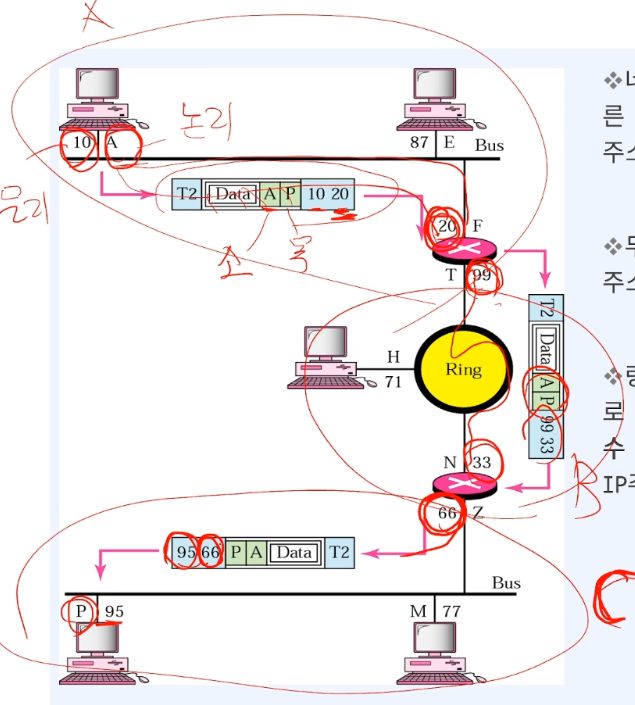

- 전송 계층(Transport layer)  
  - 개요
    - 전체 메시지의 프로세스(앱, 프로그램) 대 프로세스 전달에 대한 책임을 가짐
    - 전체 메시지가 완전하게 바른 순서로 도착하는 것을 보장
    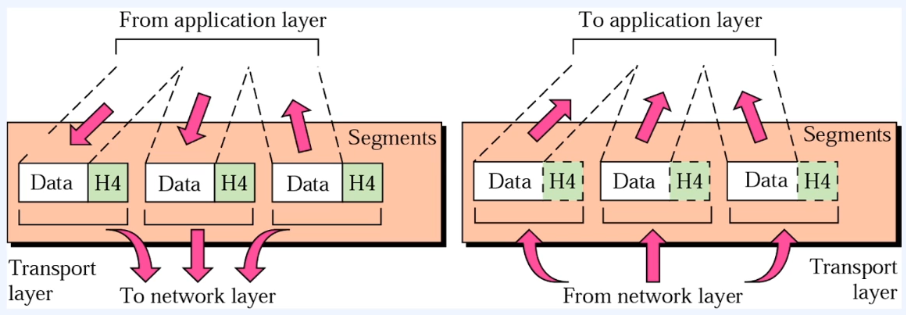
  
  - 기능
    - 프로그램은 포트를 통해 전송한다.
    - 포트 주소 지정(port addressing)  
      포트 주소를 포함
      - 네트워크 계층은 각 패킷을 정확한 컴퓨터에  
        전송 계층은 해당 컴퓨터의 정확한 프로세스(프로그램)에게 전달
    - 분할 과 재조립(Segmentation and reassembly)
      - **전달 가능한 세그먼트 단위로 나눔**
      - 각 세그먼트는 순서번호를 가지며 이를 통해 재조립 또는 패킷의 손실여부 판단
    - 연결 제어(Connection control)
      - 비 연결 및 연결지향
    - 흐름 제어(Flow control)
    - 오류 제어(Error control)

  - 프로토콜
    - TCP(Transmission Control Protocol)
      - 연결형 서비스로 가상 회선 방식을 제공
        - 가상 회선 방식  
          데이터를 전송하기 전에 논리적 연결
          경로 설정시 한 번만 하여 그 경로를 쭈욱 이용
      - 신뢰성 보장, 3-way handshaking 과정을 통해 연결
      - 전이중(Full-Duplex), 점대점(Point to Point) 방식
    - UDP(User Datagram Protocol)
      - 비연결형 서비스로 데이터그램 방식 제공
        - 데이터그램 방식  
          논리적 연결을 하지 않고 패킷이 독립적으로 전송  
          패킷 마다 서로 다른 경로로 전송될 수 있어  
          송신 때 전송한 순서와 수신 때 도착한 순서가 다를 수 있다
      - 신뢰성이 낮다
      - TCP 보다 속도가 빠르다
    - SCTP(Stream Control Transmission Protocol)
      - SCTP 는 UDP 와 TCP 의 특성을 결합
      - UDP나 TCP 와 유사하며 다중 연결을 지원
  
  - 전달
    메시지의 프로세스 대 프로세스 전달  
    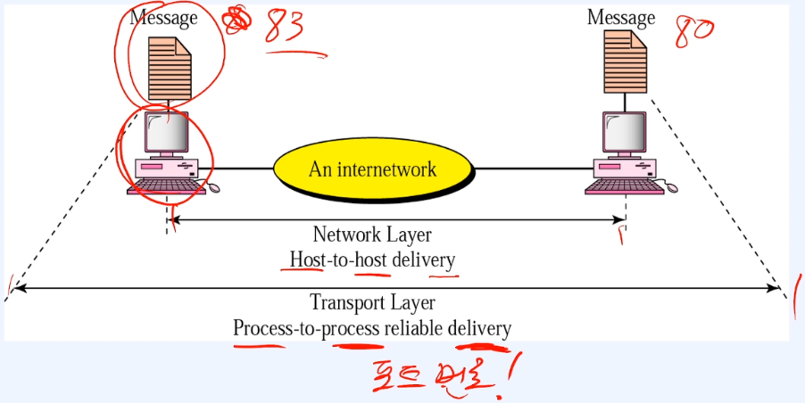

  - 예시  
    하위 계층 처럼 각 계층의 전달을 보장하고  
    전송 계층에서는 포트를 이용 프로세스와 프로세스를 연결 할 포트를  
    헤더에 넣어서 하위 계층으로 내려준다  
    보내기 전에 프로토콜에 맞춰 경로를 설정 하는 등의 작업을 하고  
    수신 측에서는 프로토콜에 따라 패킷을 맞추던 그냥 받아서 올리던 한다.
    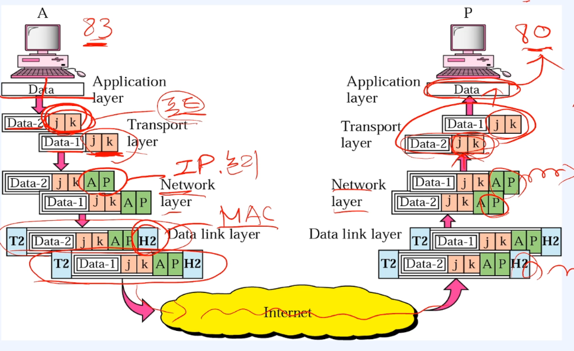

- 응용 계층(Application layer)
  - 사용자가 네트워크에 접근할 수 있도록 해 줌
  - 사용자 인터페이스 제공
  - 서비스  
    원격 로그인, 파일 액세스, 전송, 관리, 메일 서비스, http www 웹 등등
  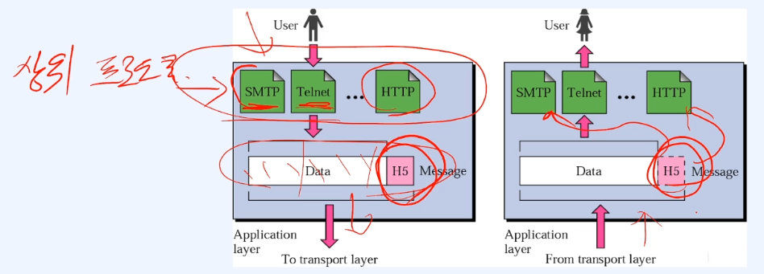

- 프로토콜 및 프로그램
  - FTP(File Transfer Protocol)
  - Telnet
  - SMTP(Simple Mail Transfer Protocol)
  - DNS(Domain Name Sysnte)
  - HTTP
  - DHCP - 동적IP할당
  - Ping
  - Tcpdump
  - Trancerouter

- 각 계층과 프로토콜의 비교
  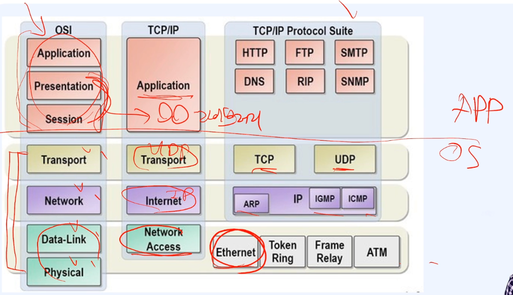

- Application 과 조합되는 프로토콜
  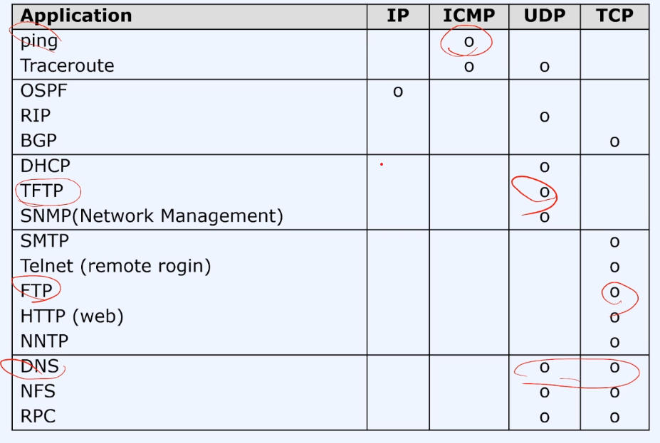
  

