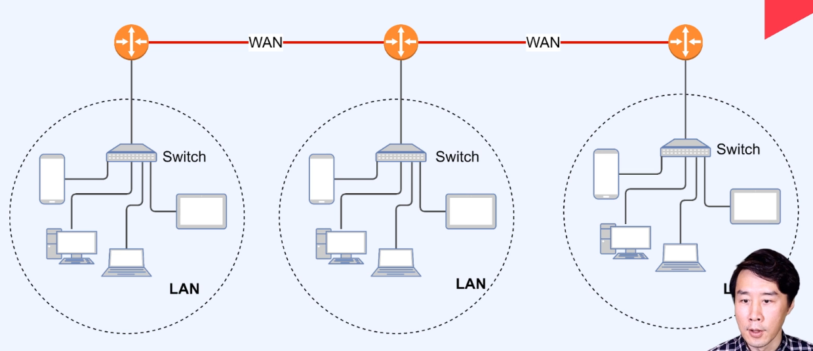
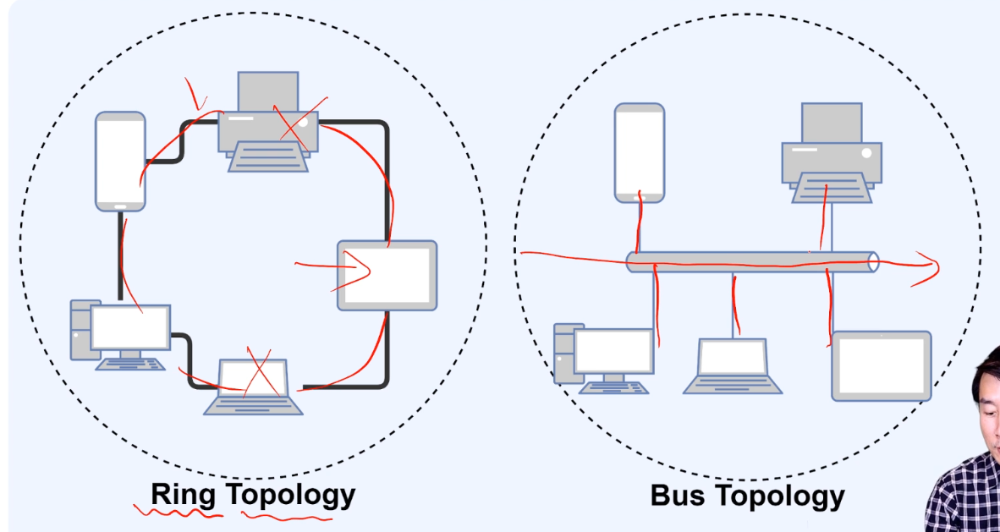
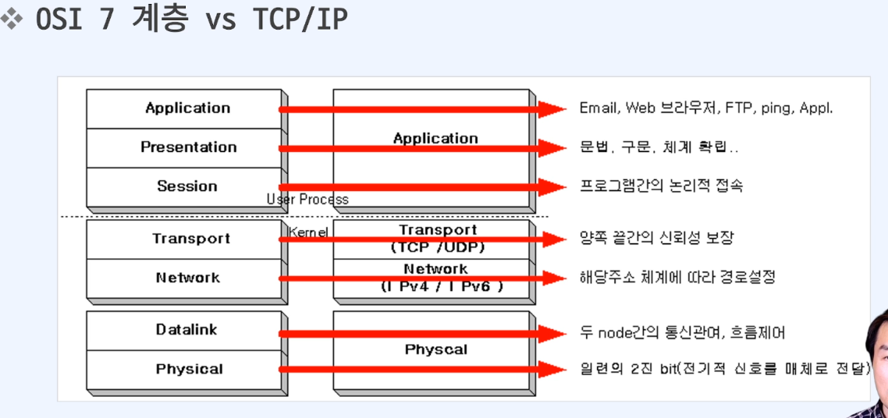
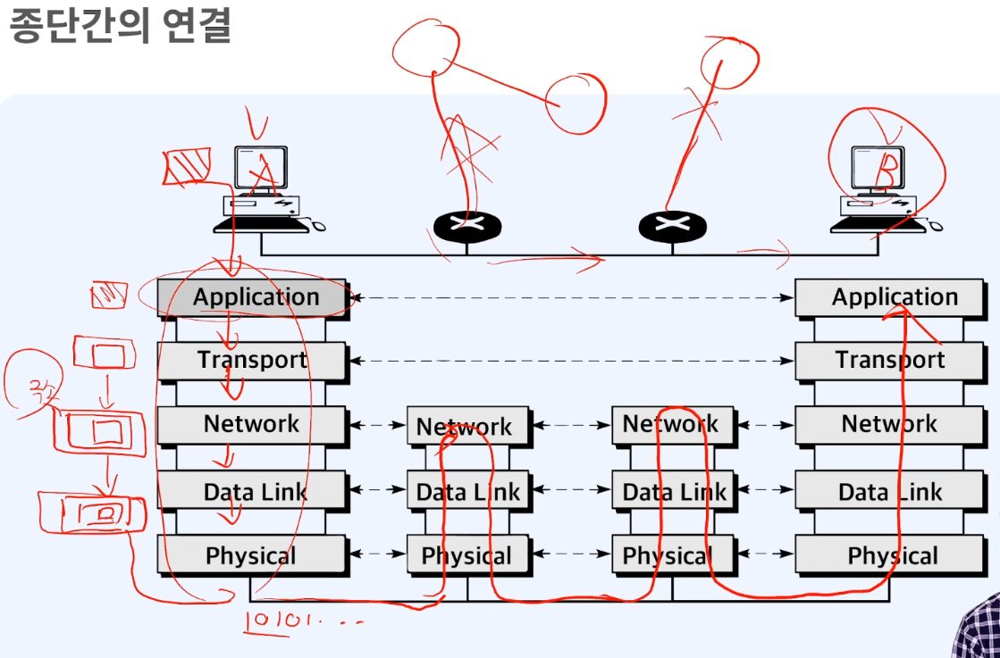
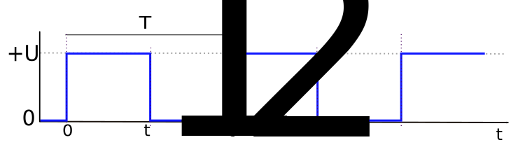
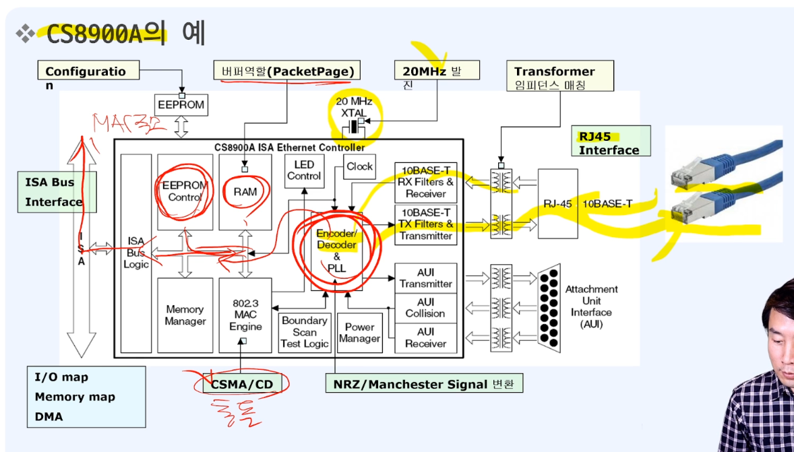
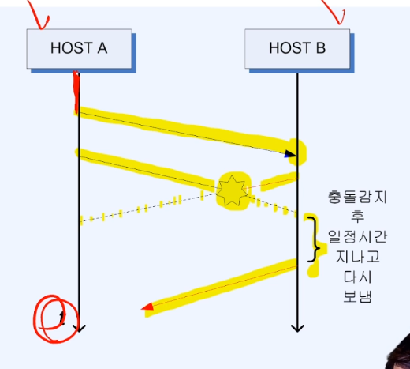

# 220526 FC
한 번에 끝내는 컴퓨터 공학 전공필수 & 인공지능 심화 초격차 패키지 Online. 

## 컴퓨터 네트워크
- 네트워크
  - 종단 시스템(end system)  
    pc나 스마트폰 처럼 네트워크 송수신 주체
  - 프로토콜(Protocol)
    두 이종 시스템을 연결하기 위한 규약
  - 통신을 목적으로 실제 물리적으로 선으로 연결되어 있거나 무선으로 연결됨
- 인터넷  
  회사 혹은 소규모의 네트워크에서 전세게 네트워크와 연결된 상태
  - 다양한 애플리케이션 서비스 제공
  - 종단 시스템은 보통 ISP(Internet Service Provider) 에 의해 연결

- OSI 7계층(Layer)  
  네트워크 구성요소를 7개의 계층으로 역할을 나눈 표준 모델
  - 각 계층별 역할을 통해 통신 규격(프로토콜)을 만족
  - 일부 하위계층은 하드웨어에서 구현되어 상위계층은 소프트웨어로 구현
- TCP/IP(Tranmission Control Protocol/Internet Protocol)
  OSI 7계층이 나오기 전 널리 사용되던 사실상 표준 역할
  - 각 계층별 역할에 따라 역할이 나누어짐
  - OSI 7계층이 대부분이 가지고 있음

- IP 주소(Address)  
  통신 자료를 최종적으로 전달하기 위해 필요한 송/수신 위치정보
  - 보통 IPv4의 주소 사용, 주소 부족으로 IPv6 개발
- 패킷 교환(Packet Switching)  
  종단간에 전송되는 데이터를 패킷(Packet)이라는 단위로 전달  
  말 그대로 데이터를 패킷으로 쪼개서 전달하는 것을 말한다
  - 패킷은 네트워크를 통해 일정한 순서없이 보내지며  
    어떤 경로를 통해 이동 되는지는 네트워크의 상항에 따라 다르다.

- 통신을 위한 기본 동작
  - 요청(Request)  
    전송하는 종단 장치에서 상대방에 서비스를 요청한다
  - 인지(Indicate)  
    수신하는 장치에서 작업 요청(이벤트)을 확인하다
  - 응답(Response)  
    수신하는 장치에서 요청받은 작업에 대해 적절히 응답한다
  - 확인(Confirm)  
    전송 측에서 응답 데이터를 최종적으로 확인하다.

- 네트워크의 유형
  - LAN(Local Area Network)
    - 일정 그룹의 지역 네트워크 (집, 사무실, 학교 등)
    - 소규모로 묶이면 사실망 등을 구축해 연결
  - WAN(Wide Area Network)
    - 원거리 통신망으로 넒은 범위 연결 (국가, 대륙 등)
  - 크기 유형
    - LAN \< WAN \< Internet

LAN 을 스위치로 묶고 LAN 들을 다시 WAN 으로 묶고...

- 네트워크 토롤로지
  - Ring  
    기기 간 링 형식으로 연결  
    설치 수월, 하나가 고장나면 ㅂㅂ
  - Bus  
    하나의 메인 회선에 전부 달아놓은 형태 - 초기 전산실...
  - Star  
    허브에 각각 연결 - 집에서 보통...
  - Mesh  
    하나의 장비에 여러 장비를 연결  
    어디가 고장나도 사용 가능

### 네트워크의 계층별 역할
- OSI 7 Layer 와 TCP/IP의 관계

- 물리 계층(Physical layer)
  - 개요
    - 물리적 매체(transmission medium)를 통한 비트 스트림(비트를 쭈욱 보내는 과정) 전송에 요구되는 기능을 담당 (기계적, 전기적, 전송매체)
    - 물리적인 장치와 인터페이스 전송을 위해 필요한 기능과 처리절차 규정
  - 주요기능
    - 인터페이스와 매체의 물리적인 특성  
      장치와 전송매체 간의 인터페이스 특성을 규정
    - 비트의 표현  
      비트를 전송하기 위해 전기적 또는 광학적인 신호로 부호화  
      실제 신호로 비트를 표현한다는 것
    - 데이터 속도  
      신호가 유지되는 비트의 주기를 규정  
      보내는 쪽 과 받는 쪽이 속도가 맞아야 한다  
    - 비트의 동기화  
      송신자와 수신자는 같은 클록을 사용  
      클록 - H(1)/L(0) 이 주기적으로 나타나는 방형파(파가 장방형(직사각형))  
      
  - 하드웨어
  

- 물리계층을 위한 프로토콜
  - MAC(Medium Access Control) 필요  
    전기신호를 주고 받는 것이기 때문에 서로 보내면 충돌이 일어나기 때문에 해결을 위한 알고리즘이 필요
    - 자유경쟁(선착순)
      - Aloha
      - Slotted Aloha - 간격 할당
      - CSMA(Carrier Sense Multiple Access)
      - CSMA/CD(CSMA/Collison Detection)
    - Token
  - CSMA/CD -> IEEE 802.3 (표준)
    - 한 slot 의 크기에 잼 신호(내가 보낼테니 다른 곳은 멈춰라)
      - 51.2 us = 64byte 전송소요 시간
    - 16번까지 재시도  
    