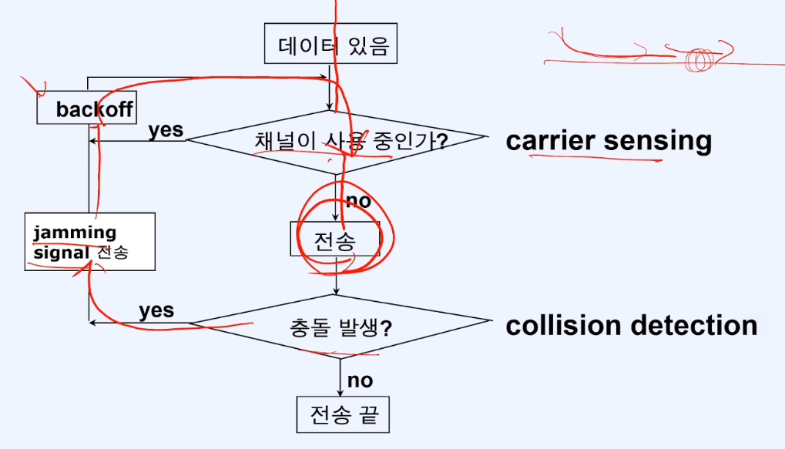
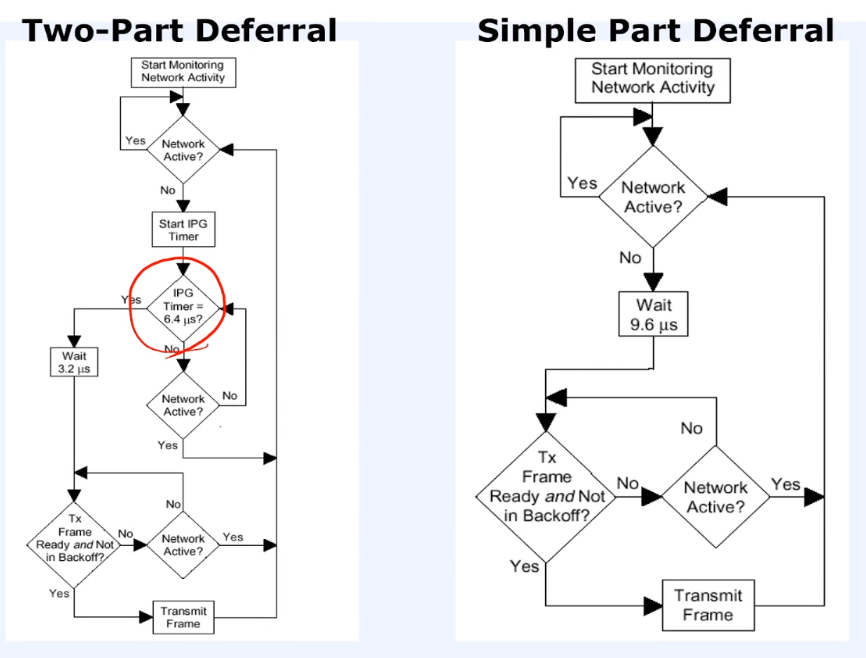
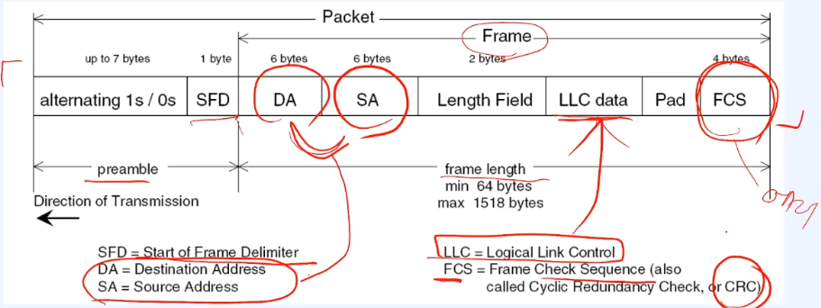
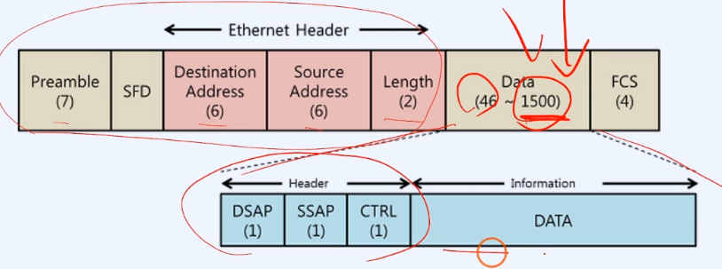
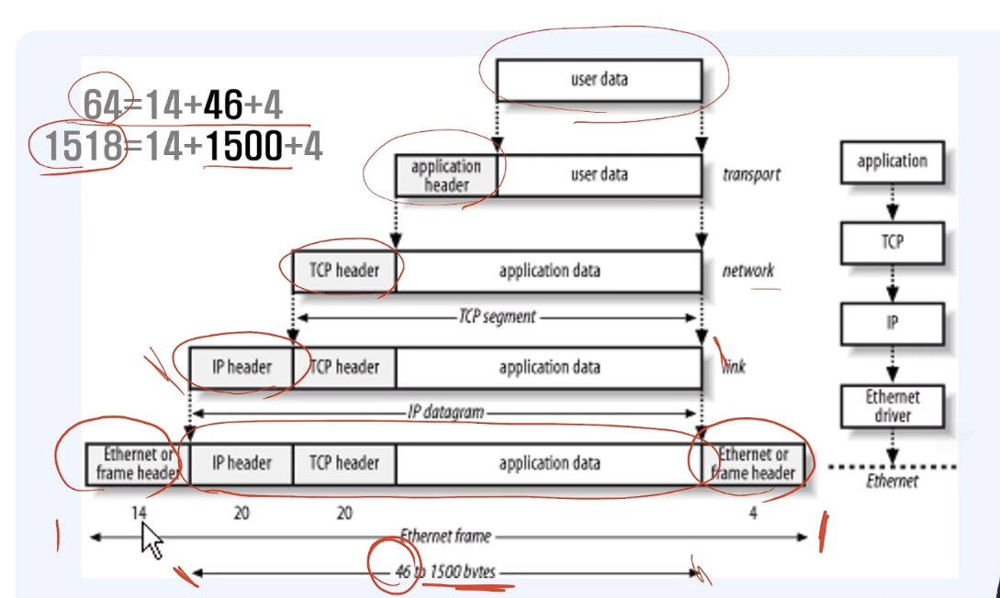

# 220527 FC

## 네트워크

### 디바이스
- NIC(Network Interface Controller)
  - 네트워크 장비와 LAN 사이의 통신을 준비
  - 전송될 데이터를 병렬에서 직렬로 전환
  - 빠른 전송을 위해서 데이터를 코딩 및 압축
  - 목적지 장비의 NIC 는 데이터를 수신하고 CPU로 데이터를 전달
  - Access Control 기능이 구현된 하드웨어와 펌웨어가 들어 있다
- 연결 방식
  - 유선 혹은 무선으로 설계될 수 있다
  - 이더넷, 기가비트 이더넷, 광섬유, 토큰링 ...
- CSMA/CD 기본 알고리즘  
  

- 이더넷 계층 구조  
  - 이더넷  
    IEE 802.3 표준으로 OSI 계층의 물리(Physical), 데이터연결(Data link) 부분을 담당  
  - LLC: 흐름제어와 오류제어를 담당
  - MAC: CSMA/CS 접근 방법에 대한 동작을 담당  

    | OSI             | Ethernet                  |
    | --------------- | ------------------------- |
    | Data Link Layer | Logical Link Control(LLC) |
    |                 | Media Access Control(MAC) |
    | Physical Layer  | Physical Layer            |
  
  - 이더넷 프레임(Frame) 포맷
    - 프레임 Encapulation 과 Decapsulation 중 전송시
      1. 한번에 보내는 적잘한 프레임 바이트 수(5,381,2012 또는 full프레임)가  
        치베 메모리에 전송되고 네트워크에 접속 할 수 있게 한다.
      2. 이어서 MAC 은 Start-of-Frame Delimiter(SFD, 10101011b)뒤에  
        7byte preamble(1010101b...)을 전송한다.
      3. SFD와 FCS 사이의 데이터는 host 에서 공급된다.  
        칩이 제공하는 FCS 생성기는 inhibitCRC bit가 set 됨에 따라 비활성 된다  
    
  
  - 이더넷 프레임 길이  
  

  - 프레임의 길이와 데이터 길이  
  

  