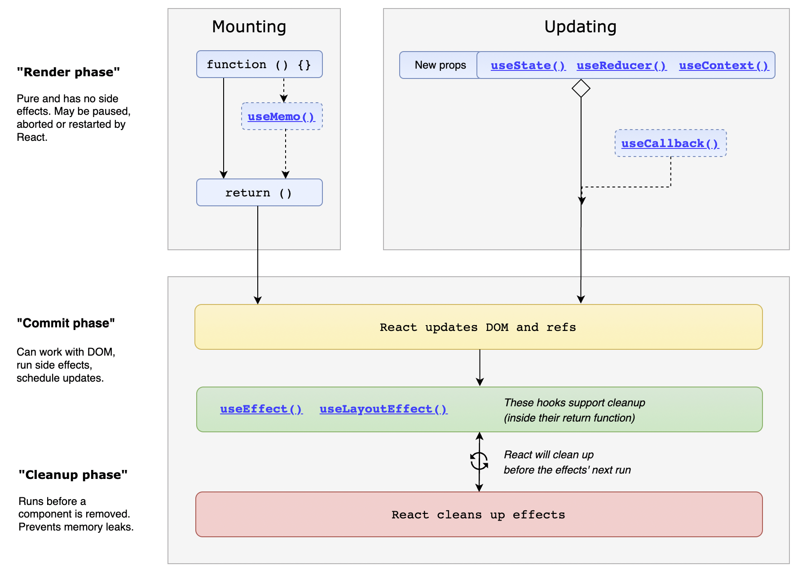
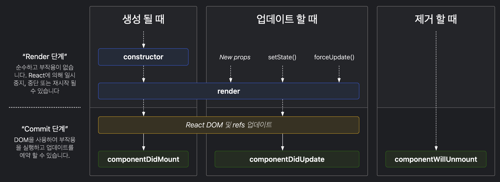

# 220727 live

## react 생명주기
컴포넌트가 표시되고 사라지는 순간까지를 하나의 생명 주기라고 표현  
 

mount (컴포넌트가 표시될 때)  
→ update (컴포넌트 내부의 요소가 업데이트될 때)  
→ unmount (컴포넌트가 사라질 때)

### `useEffect`
1. mount (컴포넌트가 표시될 때)
    ```jsx
    useEffect(() => { ... }, []);
    ```

1. update (컴포넌트 내부 요소가 업데이트될 때) + mount?
    ```jsx
    useEffect() => { ... }, [업데이트 되는지 지켜볼 변수/State]);
    ```

1. unmount (컴포넌트가 사라질 때)
    ```jsx
    useEffect(() => {return () => { 여기가 실행 }})
    ```

**[삼항연산자 주의점]**

**삼항연산자를 중첩시켜서 아래처럼 사용하는 것은 대표적인 anti-pattern 입니다!**

사용하지 않으시는게 좋습니다!

```jsx
{isLoaded ? (isFetched? <>Fetch 완료</> : <>Fetch 중</>) : <>로딩 중</>}
```

### Class Component

#### cra 사용 시
`transform-class-properties` 문법으로 써야 쉬움
**아래 내용은 cra 로 구성시 가능한 문법**
`props`, `defaultProps`
```js
import React, { Component } from 'react';

class Comp extends Component {

  render() { // render() 를 붙여줘야만 렌더가 됨
    const { name } = this.props;

    return (
      <div>
        <h1>{name}</h1>
      </div>
    );
  }
}

Comp.defaultProps = {
  name: '기본 이름'
}

export default Comp;
```
`state`
```jsx
import React, { Component } from 'react';

class Comp extends Component {
  state = {
    num: 0
  }

  countUp = () => {
    this.setState({
      num: this.state.num + 1
    });
  };

  countDown = () => {
    this.setState({
      num: this.state.num - 1
    });
  };

  render() { // render() 를 붙여줘야만 렌더가 됨
    return (
      <div>
        <h1>{this.state.num}</h1>
        <button onClick={this.countUp}>카운트업!</button>
        <button onClick={this.countDown}>카운트다운!</button>
      </div>
    );
  }
}

export default Comp;
```

#### 바닐라 JS 로 작성 시

화살표 메소드가 아니라 일반 함수 방식의 메소드의 경우  
`constructor` 안에서 `this` 를 binding 해줘야 한다.
```jsx
import React, { Component } from 'react';

class Comp extends Component {
  constructor(props) {
    super(props); // 작성해줘야만 this 사용 가능
    this.countUp = this.countUp.bind(this); // bind 해줘야만 해당 함수 내에서 this 사용 가능
    this.countDown = this.countDown.bind(this);
	  this.state = {
	    num: 0
	  }
	}

  countUp() {
    this.setState({ // 위에 bind 해주는 과정에 없으면 undefined 가 표시되게 됨
      num: this.state.num + 1
    });
  };

  countDown() {
    this.setState({
      num: this.state.num - 1
    });
  };

  render() { // render() 를 붙여줘야만 렌더가 됨
    return (
      <div>
        <h1>{this.state.num}</h1>
        <button onClick={this.countUp}>카운트업!</button>
        <button onClick={this.countDown}>카운트다운!</button>
      </div>
    );
  }
}

export default Comp;
```

#### life cycle
  

`constructor` 이 render 이 전에 실행


`componentDidMount`
컴포넌트/요소가 생성될 때
```jsx
componentDidMount() {
	// 생성 후 렌더링 시 실행될 코드
}
```

`componentDidUpdate`  
컴포넌트/요소가 업데이트될 때 - 최초 렌더링 때 호출 X
여기서 업데이트를 하면 다시 실행됨으로 조심해야 한다
```jsx
// 업데이트 되기 이전의 Props, State 값을 받아옴
componentDidUpdate(prevProps, prevState) { 
  // 업데이트 된 값과, 업데이트 되기 이전의 값을 직접 비교해서, 함수를 실행시킴
	// dependency 가 있던 useEffect 와는 차이가 있음에 유의!
  if (this.props.num !== prevProps.num) {
    // num 이 업데이트되었을 때 실행할 코드
  }
}
```

`componentWillUnmount`  
컴포넌트가 제거될 때
```jsx
componentWillUnmount() {
	// 컴포넌트 사라지기 직전에 호출 (실행 중인 함수 종료 등, 메모리 누수 방지)
}
```

## 이벤트 처리
```jsx
// vue 랑 다른게 클릭 시 실행 되는 것이 아니라 그냥 실행됨으로 주의
<button onClick={showMsg()}></button>
```

### `useRef`
- html DOM 을 가져다 쓰고 싶을 떄
  ```jsx
  import React, { useRef } from 'react'

  function Refs() {
    const a = useRef()

    const keyHandler = () => {
      console.log(a.current.value)    
    } 

    return (
      <>
          <input ref={a} onKeyDown={keyHandler}/>
      </>
    )
  }

  export default Refs
  ```

- 값이 변해도, 재렌더링 되지 않는 변수를 만들고자 할 때  
  변수(`const`, `let`) 의 경우 재렌더링 시 다시 선언!  
  `useRef` 의 경우 재렌더링되더라도 다시 선언되지 않고, 변한 값이 그대로 남아 있음  
  ```jsx
  import React, { useRef } from 'react'

  function Refs() {
    const a = useRef(0)

    const keyHandler = () => {
      console.log(a.current + 1)    
    } 

    return (
      <>
          <p>{a.current}</p>
          <button onClick={keyHandler}>버튼!</button>
      </>
    )
  }

  export default Refs
  ```
