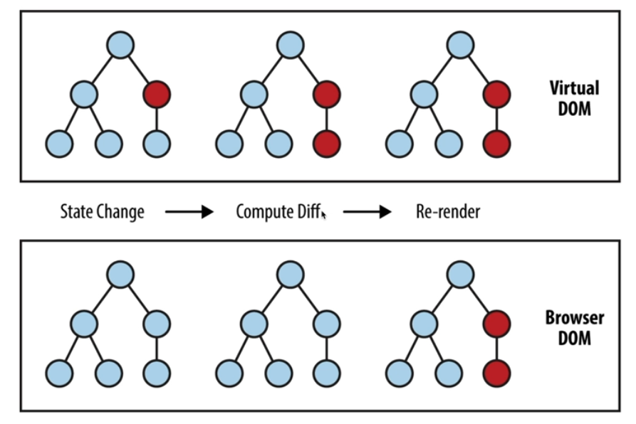
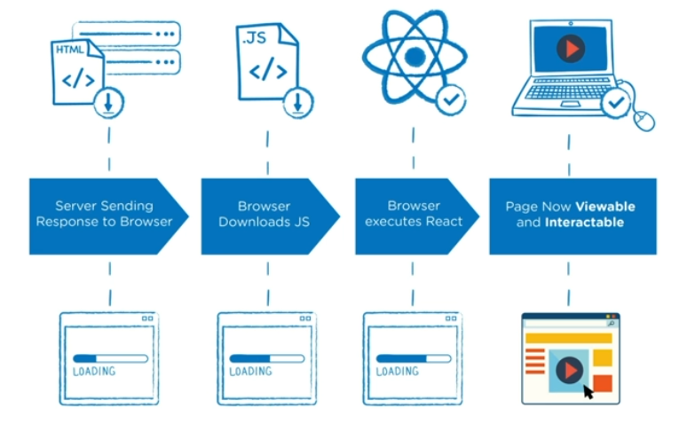
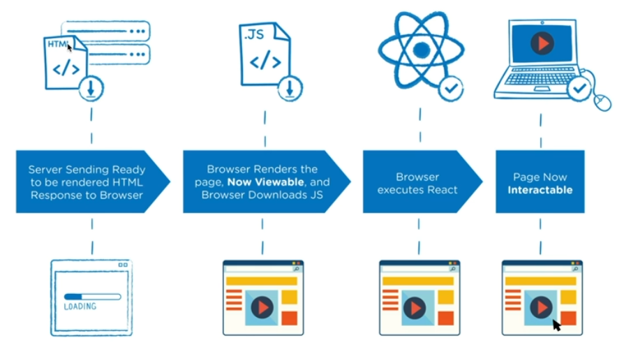

# 220801 - FC

## Virtual DOM
DOM 으로 직접 제어하면 정확히 바꿔줘야 하지만  
가상돔 트리를 사용해 이전 상태와 이후 상태를 비교하여 바뀐 부분만 찾아서 바꾼다
diff 로 변경

## CSR / SSR

- CSR
  - JS 가 전부 다운로드 되어야
    - 애플리케이션이 정상 실행되기 전까지 화면 X
    - 화면이 보이면서 유저가 인터렉션 가능
- SSR
  - JS 가 전부 다운로드 되지 않아도 일단 화면은 보이지만 유저가 사용 할 수 없음
  - JS 가 전부 다운로드 되어 애플리케이션이 정상 실행 된 후, 유저가 사용 가능
