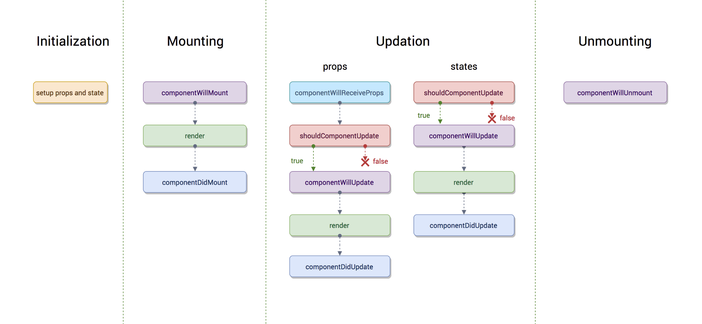
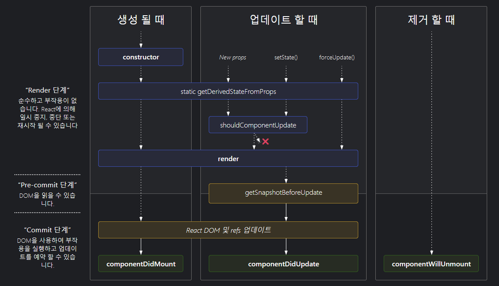
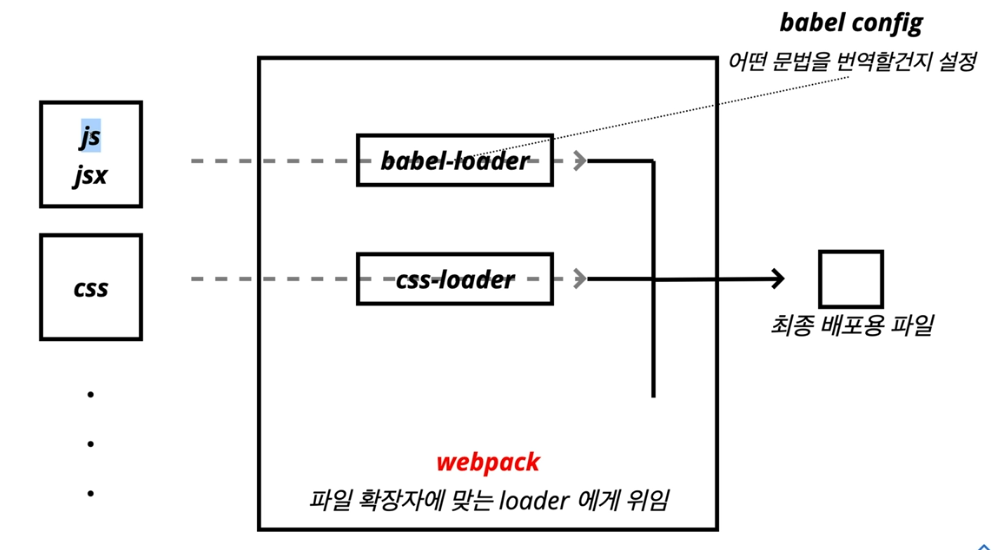

# 220803 FC

## Props/State
Props 는 컴포넌트 외부에서 컴포넌트에서 주는 데이터  
State 는 컴포넌트 내부에서 변경할 수 있는 데이터  
둘 다 변경이 발생하면 렌더가 다시 일어 날 수 있음  

### `render(...)`  
컴포넌트를 그리는 방법을 기술하는 함수

## Props
```jsx
function Component(props) {
  return (
    <div>
      <h1>{props.message}</h1>
    </div>
  )
}

// 기본값
Component.defaultProps = {
  message = "기본값"
}

class Component extends React.Component {
  render() {
    return (
      <div>
        <h1>{this.props.message}</h1>
      </div>
    )
  }

  // 기본값
  static defaultProps = {
    message = "기본값"
  }
}

ReactDOM.render(
  <Component message="안녕하세요" />,
  document.querySelector("#root")
)
```

## State
```jsx
class Component extends React.Component {
  // 객체 형태만 가능
  // 방법1
  state = {
    count: 0,
  }

  contructor(props) {
    // 반드시! 맨 처음에!
    super(props);
    
    // 방법2
    this.state = { count: 0 }
  }

  render() {
    return (
      <div>
        <h1>{this.state.count}</h1>
      </div>
    )
  }

  testSetState() {
    // 방법1
    this.setState({
      count: this.state.count + 1
    })
    // 방법2
    this.setState((previousState)) => {
      return {
        count : previousState.count + 1
      }
    }
  }

  // 기본값
  static defaultProps = {
    message = "기본값"
  }
}
```

## Event Handling
HTML DOM 이벤트를 연결 / 실제 태그이면 DOM 이랑 연결  

- camelCase 로만
  - onClick, onMouseEnter
- 이벤트에 연결된 JS 는 함수
  - 이벤트={함수}
- 실제 DOM 요소들만 사용 가능
  - 리액트 컴포넌트에 사용하면 props 로 전달

```jsx
function Component() {
  return (
    <button onClick={() => {}}>버튼</button>
  )
}
```

## LifeCycle
Declarative 선언적...  
라이플사이클 중간에 그 상황이 되면 그 상황에 있는 함수를 불러주는데  
이렇게 정확히 명시해놓은 것을 선언적 이라고 한다고 한다?  

[React 페이지](https://ko.reactjs.org/docs/react-component.html#the-component-lifecycle)

### 옛날 (< v16.3)


### 현재



```jsx
static getDerivedStateFromProps(nextProps, prevState) {
  // 아무 일도 없으면
  return null
  // 바뀐 props 를 이용해 새로운 state 를 만들 때
  return nextState
}

// 실제 DOM 업데이트가 일어나기 전에 불려서 현재(이전)의 DOM 값(스크롤 위치 등)
// 이 필요할 때 쓰고 실제 업데이트는 componentDidUpdate 에서 한다
getSnapshotBeforeUpdate(prevProps, prevState) {
  // 스냅샷을 return
  return snapshotValue
}

// getSnapshotBeforeUpdate 에서 보낸 snapshot 이용해서 사용
componentDidUpdate(prevProps, prevState, snapshot) { }

// 자손 컴포넌트에서 오류가 발생하면 호출!
// 자기 자신의 에러는 받을 수 없으니 에러가 나지 않는 상위에서 사용해야 함
componentDidCatch(error, info) {}
```

## CRA(Create React App)
```sh
npx create-react-app PACKAGE_NAME
```
npx 는 패키지를 받아서 바로 실행해주는 npm 커맨드라인 명령



## lint/formatter

### eslint
코드의 잘못된 점이나 에러 등을 잡아주고 고쳐준다  
먼지 모르겠지만 extends 안에 있는 애들은 보통 'eslint-config-' 가 생략되어 있다

### prettier
eslint 은 linter 지만 prettier 는 formatter 로 코드를 일관적으로 보기 좋게 해준다  
eslint 와 충돌나는 부분이 있기 때문에  
`eslint-config-prettier` 로 eslint 와 prettier 와 충돌하는 규칙을 eslint 에서  
끄는게 좋음

## git hook

### husky
Git hook 을 쉽게 만들 수 있다  
git 어떤 action 을 할 떄 먼가 할 수 있게 해줌  
husky 설치 전에 git 저장소 필요  
```sh
npm i -D husky
npx husky install
npx husky add .husky/pre-commit "명령"
```
```json
// package.json
{
  "scripts": {
    "prepare": "husky install"
  }
}
```

### lint-staged
git staged 파일들을 lint 실행

```sh
npm i -D husky lint-staged
npx husky install
npx husky add .husky/pre-commit "npx lint-staged"

```

```json
// package.json
{
  "scripts": {
    "prepare": "husky install"
  },
  "lint-staged": {
    "**/*.js": [
      "eslint --fix",
      "prettier --write"
      // 한 후에 add 를 해줘야 함
      "git add"
    ]
  }
}
```

## react-router
SPA 설명은 vue 쪽에서...  
```sh
npm i react-router-dom
```
`react-router-dom` 이 가장 대표적이라 사용

```jsx
import { BrowserRouter, Route } from 'react-router-dom'

function App() {
  return (
    <BrowserRouter>
      <Route path="/" exact compoent={Home} />
      <Route path="/profile" compoent={Profile} />
      <Route path="/about" compoent={About} />
    </BrowserRouter>
  )
}
```
`exact` 로 경로가 완전히 같으면 사용
경로 일치 확인은 위에서부터 차례대로 하니 상위 경로(여기서는 `/`) 로 볼수 있는 곳에  
`exact` 를 해줘야 적용이 된다