# 220523 FC

## Vue
`:attr="NUMBER"` 로 문자가 아니라 숫자를 직접 넣어줄수 있다  
Life Cycle Hook 은 async 로 선언할 수 없다  
(`methods` 같은 곳에 async 로 만들어서 사용하도록 하자)  

### Vue Router
| 사용 컴포넌트  | 의미                                    |
| -------------- | --------------------------------------- |
| `<RouterView>` | 페이지가 출력(렌더링)되는 영역 컴포넌트 |
| `<RouterLink>` | 페이지 이동을 위한 링크 컴포넌트        |
|                |                                         |

| 제공 객체 | 의미                                                                    |
| --------- | ----------------------------------------------------------------------- |
| `$route`  | Route(페이지) 정보를 가지는 객체<br />속성<br />`fullpath`, `params` 등 |
| `$router` | Route(페이지) 조작을 위한 객체<br />메소드<br />`push(...)` 등          |


#### URL 에서 Vue Router 로 정리


이것저것
```js
export default createRouter({
  ...,
  // 이동시 최상단으로
  scrollBehavior() {
    return { top: 0 };
  },
  routes: [
    {
      // URL 에 넘어오는 주소를 파라미터화
      path: '/movie/:id',
      component: '',
    },
    {
      // 파라미터화로 주소를 넘기고,
      // (.*) 로 위에서 정의되어 있지 않은 나머지를 처리
      path: '/:notFount(.*)'
      component: '',
    }
  ]
});
```
```js
// Vue Route 를 이용해 사용할 수 있는 객체 
this.$route
this.$router

this.$route.params.id
```

### Vuex
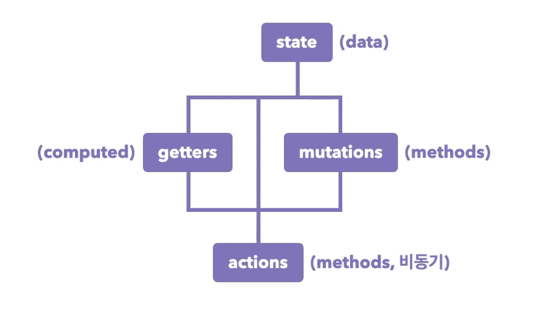
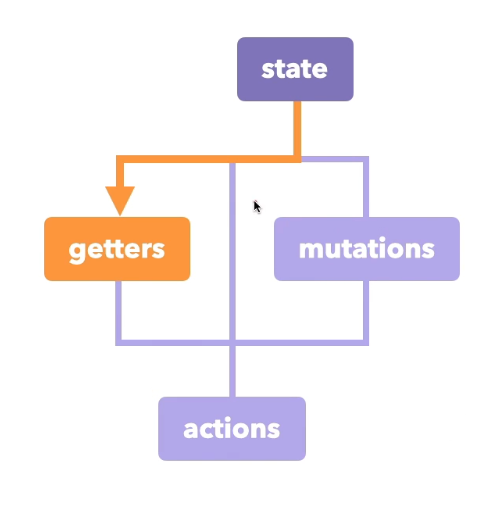
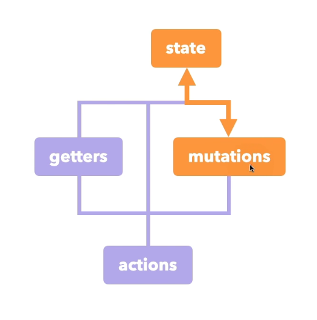
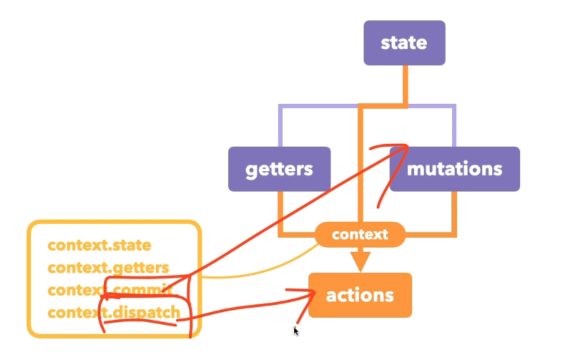
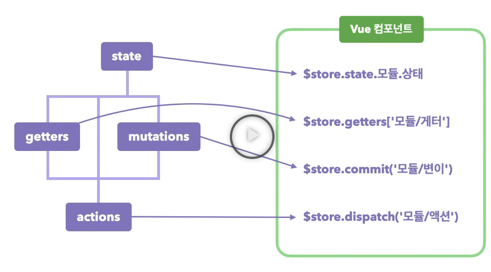
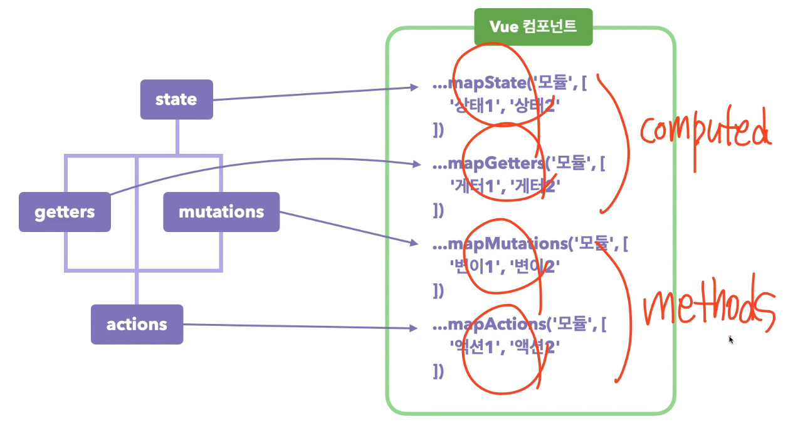

#### Helper
```js
import { mapState, mapActions } from 'vuex'

computed: {
  ...mapState(MODULE_NAME, [...stateNames])
},
methods: {
  ...mapActions(MODULE_NAME, [...actionNames])
}
```


### 플러그인
loadImage.js
```js
export default {
  install(app) {
    app.config.globalProperties.$loadImage = (src) => {
      return new Promise((resolve) => {
        const img = document.createElement('img');
        img.src = src;
        img.addEventListener('load'), () => {
          resolve();
        }
      })
    }
  }
}
```

```js
import loadImage from './loadImage.js';

createApp(App)
  ...
  .use(loadImage)
  ...
```

```vue
<script>
  ...
  await this.$loadImage(url)
  ...
</script>
```

## Web
### Traditional Web Application
전통적인 웹사이트  
데이터를 요청할 때마다 페이지 모드!  
페이지 변경시 모든 부분을 다시 가져와 다시 그림  
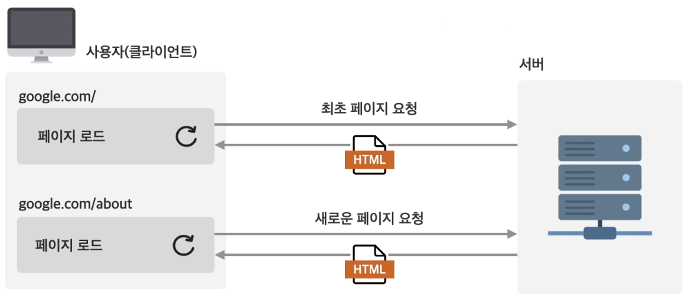  
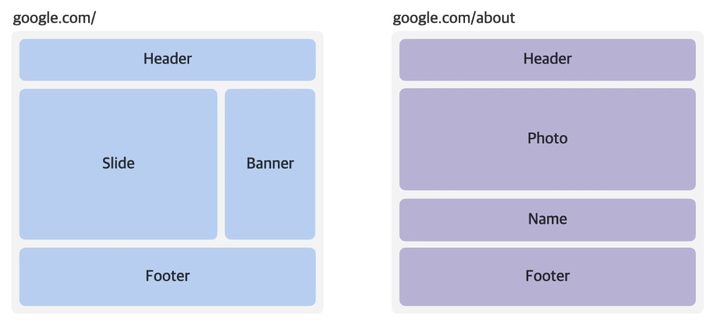  

### SPA(Single Page Application)
페이지 로드 없이 데이터 요청!  
변경된 부분만 가져와 렌더링  
페이지 전환 시 깜박임을 막을 수 있다  
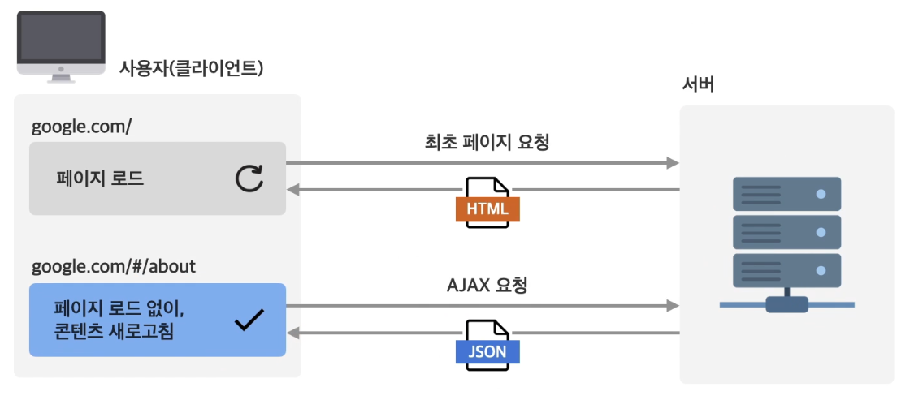  
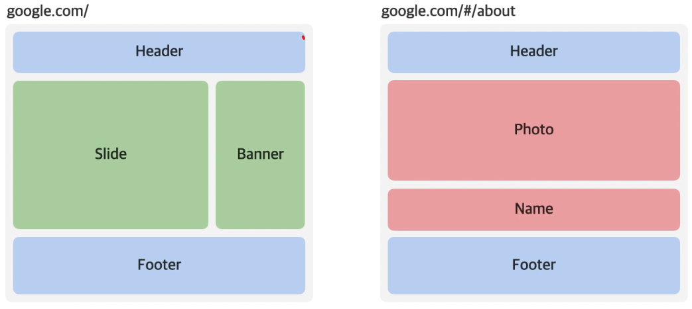  

#### 장점
1. 빠르고 자연스런 전환으로 훌륭한 사용자 경험 제공
2. 더 적게 요청해 빠르게 렌더링 가능
3. 컴포넌트 단위 개발로 생산성 향상
4. 쉬운 분업화

#### 단점
1. 느린 최초 로드 => Lazy loading, 브라우저 캐싱  
  하나의 페이지로 모두 처리하기 때문에 느림
2. 어려운 검색 엔진 최적화(CEO) => SSR, Serverless Functions
3. 모든 데이터 노출 => 비즈니스 로직 최소환

| 단점                         | 이유                                                                      |
| ---------------------------- | ------------------------------------------------------------------------- |
| 느린 최초 로드               | 하나의 페이지로 모두 처리하기 때문에 느림                                 |
| 어려운 검색 엔진 최적화(SEO) | 단일 페이지라서 분리되어져 있는 페이지의 상세한 데이터를 가져갈 수가 없음 |
| 모든 데이터 노출             | 프론트엔드 단에서 처리하기 때문에 키 같은 것이 노출됨                     |

| 단점                        | 보완 방식                  | 설명                                           |
| --------------------------- | -------------------------- | ---------------------------------------------- |
| 느린 최초 로드              | Lazy loading               | 보이지 않는 부분은 최대한 늦게 가져온다        |
|                             | 브라우저 캐싱              | 한 번 로드된 페이지는 캐싱해서 다음에는 빠르게 |
| 어려운 검색엔진 최적화(SEO) | SSR(Server Side Rendering) |                                                |
|                             | Serverless Functions       |                                                |
| 모든 데이터 노출            | 비즈니스 로직 최소화       |                                                |

### 중요데이터 노출
  
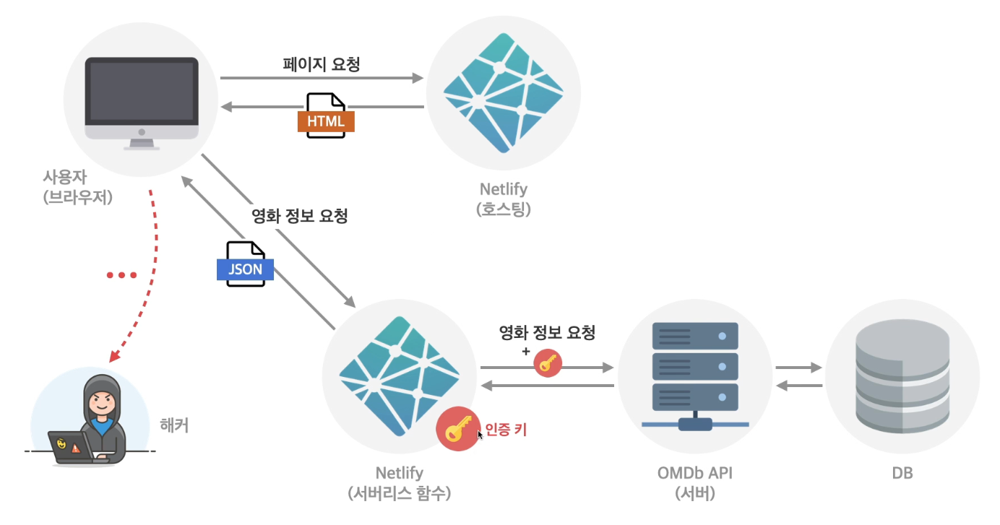  


## netlify
### functions
- URL
  DOMAIN/.netlify/functions/FUNC_NAME

netlify.toml
```toml
[build]
  command = "yarn run build"
  publish = "dist"

[dev]
  framework = "#custom"
  command = "yarn run dev:webpack"
  # 프로젝트 개발 서버 포트 - webpack 포트
  targetPort = 8079
  # netlify 가 출력 할 포트
  port = 8080
  publish = "dist"
  autoLaunch = false

[functions]
  directory = "functions/"
```
functions/FUNC_NAME.js
```js
// axios 로 간단하게
import axios from 'axios'

exports.handler = async function (event, context) {
  // method 체크 하는거 봐야함
  
  const payload = JSON.parse(event.body);

  try {
    const { data } = await axios.get(url);
    if ( data.Error ) {
      return {
        statusCode: 400,
        body: data.Error
      }
    }
    return {
      statusCode: 200,
      body: JSON.stringify(data);
    }
  } catch(e) {
    return {
      statusCode: error.response.status,
      body: error.message
    }
  }
}
```