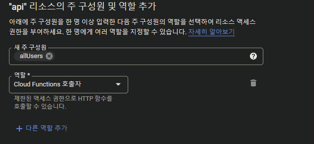
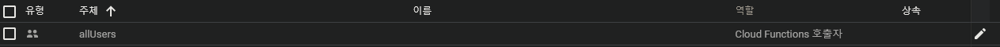

# 220701 live

## firebase
```sh
npm i -D firebase-tools
```

```json
// package.json
{
  "scripts": {
    "fb:login": "firebase login",
    "fb:logout": "firebase logout",
    "fb:init": "firebase init",
    "fb:emuls": "firebase emulators:start",
    "fb:deploy": "firebase deploy"
  }
}
```

firebase 홈페이지 - Firestore Database 에서 데이터베이스 만들기
테스트 모드에서 시작 -> Cloud Firestore 위치 = asia-northeast3(세울)

```sh
npm run fb:login
npm run fb:init

// features 모두 선택

// 아까 만든 firebase 프로젝트 선택(existing)
// 대부분 기본값(enter)이 괜찮고
// overwrite 는 yes
// functions 은 TypeScript
// host public 폴더 주의 = vite 는 dist
// single-page app  (rewrite all urls to /index.html)? (y/N) y
// Set up automatic builds and deploys with GitHub? (y/N) y

// 이후 github repository 만들어서
// github 저장소 이름 가져다가(계정명/저장소명)
// Set up the workflow to run a build script before every deploy? (y/N) Y

// Emulators 일단 전부 선택
// Emulator 들의 작동 포트
// Would you like to download the emulators now? (y/N) Y

// 짜잔

// JDK 깔아라

// firebase emulators 가 ts 를 직접 돌리지 못해 빌드(ts => js)가 해야한다
// shell 2개 필요
// 하나는 functions 에서 tsc 돌려 줄 녀석
cd functions

// functions/.eslintrc.js 수정
// parserOptions.tsconfigRootDir: __dirname 추가

// project: ["tsconfig.json", "tsconfig.dev.json"] 의 기준 프로젝트가
// 우리가 연 vscode 루트로 세팅됨 그래서 현재 폴더로 설정

// 여기서 부턴 eslint 간소화 및 커스텀
// extends 에서
// "plugin:import/errors",
//  "plugin:import/warnings",
//  "plugin:import/typescript",
//  "google",
// 삭제

// rules 에
//  'semi': ['error', 'never'],
//  'quotes': ['error', 'single'],
//  'eol-last': ['error', 'always'],
// eslint 커스텀 끝

// 일단 ts 한번 빌드
// functions/lib/ 아래 js 생성

// functions 폴더에서
// src/index.ts 수정
// 다 주석
// console.log('Hello Firebase Functions')
// export {}
npm run build

```

파이어베이스 콘솔 - functions - 상태 - cloud console로 이동
검색 - artifact Registry API(marketplace)

콘솔창 추가
functions 폴더로
npm run build:watch

원래 콘솔창
루트에서
npm run fb:emuls

파이어베이스 콘솔 - 프로젝트 개요(톱니바퀴) - 프로젝트 설정 - 
프로젝트 ID 알아두기

functions/src/routes 폴더 생성
여기서 route 관리(rest api 마다 폴더나 파일들로 관리)
todo.ts 생성

```js
// functions/src/index.ts

// 어드민 권한으로 써보자
import * as admin from 'firebase-admin'
// 초기화가 가장 먼저 해줘야 된다
admin.initializeApp()

import * as functions from 'firebase-functions'
import * as express from 'express'
import * as cors from 'cors'
import todo from './routes/todo'


const app = express()
// express 에서 json 처리
// content-type 에 맞춰서 해주는 듯?
app.use(express.json())
// cors 모두 요청
app.use(cors({
  // 요청이 오는 도메인 설정
  // origin: ['https://mydomain.com']
}))
app.use('/todo', todo)

export const PATH_NAME = functions.https.onRequest(app)
// 로컬 접근 url - emulator
// FUNCTIONS_PORT = firebase.json - emulators.functions
// https://localhost:FUNCTIONS_PORT/PROJECT_ID/us-central1/PATH_NAME/EXPRESS_ROUTE_NAME
// https://localhost:5001/PROJECT_ID/us-central1/PATH_NAME/todo
```

```js
import { firestore } from 'firebase-admin'
import * as express from 'express'

const db = firestore()
const router = express.Router()

interface Todo {
  title: string,
  done: boolean,
  createdAt: string,
  updatedAt: string
}

interface TodoRes extends Todo {
  id: string
}

// http://localhost:5001/PROJECT_ID/us-central1/api/todo
router.get('/', async (req, res) => {
  // 조건
  //.where('FILED_NAME', 'OP', VALUE)

  // 컬렉션 전부 읽기
  const snaps = await db.collection('Todos').get()

  const todos: Array<TodoRes> = []
  snaps.forEach((snap) => {
    const todo = snap.data() as Todo
    todos.push({ id: snap.id, ...todo })
  })

  res.status(200).json({
    todos
  })

  /*
  res.status(200).json({
    todos: snaps.docs.map( (snap) => ({ id: snap.id, ...snap.data() }) )
  })

  */
})
router.post('/', async (req, res) => {
  const { title } = req.body
  if (!title) {
    res.status(400)
    return
  }

  const date = new Date().toISOString()
  const todo: Todo = {
    title,
    done: false,
    createdAt: date,
    updatedAt: date,
  }

  // collection 에 접속 후 document 만들기
  const ref = await db.collection('Todos').add(todo)
  const body: TodoRes = {
    id: ref.id,
    ...todo
  }

  res.status(200).json(
    body
  )
})
// router.put('')
// router.delete('')

export default router
```

firebase 에뮬이 꺼지면 데이터들이 지워지는데
`firebase emulators:start --import=./exports --export-on-exit`
로 실행하면 저장된다  
`--export-on-exit` 는 종료 시 export
`--import=./exports` 는 시작 시 가저올 위치

firebase console
storage 에 bucket 추가

deploy 후
cloud functions 가서 추가한 api 가서 권한 추가



## github actions
.github/workflows
yml 파일로 만들어서 하는거다

## 라이브러리?
- validator(c/e)  
  검증 라이브러리
- file-type(c)  
  파일 타입 알아내기
- nanoid(e/3=c)  
  랜덤 id 받아오기


## 데이터 시각화
d3.js
chart.js
- 보통 많이 씀
echarts
- 아파치

